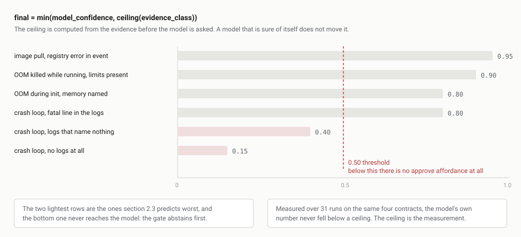

# Coroner

Coroner performs an autopsy on a Kubernetes workload that something else has already declared dead. It collects the evidence a competent on-call engineer would collect by hand, proposes one root cause and one remediation, cites every claim to a collected field, and asks a human before it touches anything.

[](https://github.com/saadhtiwana/Coroner/actions/workflows/ci.yml)

It is built around an uncomfortable premise: for a large share of real incidents the evidence available at the moment of failure does not contain the cause, and a language model asked to explain one of those will produce a fluent, specific, wrong answer. Most of the machinery here exists to make that failure visible instead of persuasive.

---

## What it does

1. Watches for a pod entering one of four failure shapes.
2. Collects an evidence contract at detection time: pod identity and owner chain, container status and spec, events filtered by pod UID, the previous container's logs, and node conditions. Environment variable values are never read.
3. Classifies what that evidence can support, before any model is asked.
4. Produces a diagnosis and one concrete remediation, with an `evidence` array of citations.
5. Checks every citation against the contract that was actually sent, in code.
6. Renders observed facts and inferred claims as separate blocks, to stdout or Slack, and offers approval only where approval is warranted.
7. Records everything to an append-only ledger, before any of it is delivered.

## What it does not do

Coroner sits **downstream of alerting**. It does not decide that something is wrong; it explains something already known to be wrong. It stores no time series, scrapes nothing, serves no dashboards, defines no alert rules, pages nobody, and never acts on a timer or a threshold. Prometheus, Grafana, and a log store remain the system of record.

It never changes cluster state without a recorded human approval keyed to a specific diagnosis.

---

## Architecture


Two processes, and the split is the safety property rather than a deployment convenience.

The **agent** holds cluster credentials and nothing else. Its RBAC is read-only until execution is deliberately enabled with a separate manifest and a flag. It will not execute an action whose approval token it cannot verify.

The **brain** holds a model credential and no cluster credentials at all. It is the process reachable from outside, because it is the one that can do nothing to your cluster if it is compromised.

---

## Quickstart

One command, one environment variable, about five minutes, most of it waiting for workloads to break.

```
git clone https://github.com/saadhtiwana/Coroner.git
cd Coroner
GROQ_API_KEY=your-key make demo
```

This creates a local kind cluster, breaks one workload per failure shape, collects the evidence, diagnoses each, and prints the results. No Slack, no manifests to edit, no images to build or publish. `make demo-down` removes everything.

Requires `docker`, `kind`, `kubectl`, `go`, and `uv`. The demo builds both services from source; see [DESIGN 6.20](docs/DESIGN.md#620-the-demo-runs-from-source-and-says-so) for why that is a compromise rather than the intent.

**In a cluster you already have**, without cloning:

```
kubectl create namespace coroner
kubectl create secret generic coroner-model -n coroner --from-literal=api-key=your-key
kubectl apply -f https://raw.githubusercontent.com/saadhtiwana/Coroner/main/deploy/install.yaml
kubectl logs -n coroner deploy/coroner-brain -f
```

---

## Accuracy

**Pending.** The evaluation harness is written and the incidents are built; the run is not finished, and no numbers are published here until it is.

What is already committed, in advance and in writing, is the prediction. [DESIGN section 2.4](docs/DESIGN.md#24-committed-prediction) states what each failure class should achieve before any of it was implemented, so the measurement can falsify it rather than be rationalised against it:

| Failure type | Predicted root-cause accuracy | Confidence in the prediction |
| --- | --- | --- |
| ImagePullBackOff | 90 percent | high |
| OOMKilled | 95 percent on "killed for memory", 50 percent on why | medium |
| CrashLoopBackOff | around 60 percent blended | low, widest error bar |

Three falsification criteria are committed with them. If ImagePullBackOff lands below 75 percent, the prompt or the parser is wrong, because the cause is verbatim in the event message. If CrashLoopBackOff lands below 40 percent over 20 or more incidents, the context contract is wrong, not the prompt. If it exceeds 80 percent, the sample is biased toward well-instrumented applications and should not be generalised.

The harness builds 69 incidents, at least 20 for each of the three failure types, counting the two OOM shapes together, each with a cause known before Coroner sees it because it was constructed. Every row of the design's CrashLoopBackOff table is represented deliberately, including the ones expected to fail: logs that name nothing, and no logs at all. Results are reported per failure type and never as a single aggregate, since an aggregate would let the near-deterministic class carry the mean while the valuable one is broken.

```
make eval-collect    # build every incident, capture its evidence once
make eval-diagnose   # diagnose each, resumable across rate-limit windows
make eval-score      # score against the constructed truth
```

---

## How it works


### The evidence contract

The contract is a versioned schema, not a convention, and it is deliberately not a marshalled Kubernetes object. Three properties in it were learned from recordings rather than reasoned about:

- **Events are filtered by `involvedObject.uid`, never by name.** A recreated pod of the same name contributes its events otherwise, which attributes a previous incarnation's failures, and a different root cause, to the current one. In a rollout loop this is the normal case.
- **Logs are captured at detection time and persisted immediately.** Log availability is racy: the same pod returned logs at one moment and `unable to retrieve container logs` minutes later. Collecting lazily produces an empty evidence set for the single most important source.
- **`logs_available` and `logs_empty` are separate fields.** "The container wrote nothing" and "the runtime discarded the container" are different facts and earn different confidence.

### Hallucination controls

The dangerous failure is not Coroner saying nothing. It is Coroner saying something specific, plausible, and wrong; a human approving it because it reads like competence; and the resulting action making a live incident worse.

**The approval gate is not the safety mechanism.** A human at 3am, handed a confident paragraph and a button, will approve. A design that treats the gate as the defence has misplaced the defence. The gate only protects if the human is given a real basis on which to reject, which is what the controls below are for. They are ordered strongest first, and the first four are code that runs whatever the model does.

**1. Insufficient context is a first-class success.** A CrashLoopBackOff whose logs could not be retrieved and whose exit code is generic routes to `INSUFFICIENT_CONTEXT` *before* the model is called. There is no reason to spend a call on a context already known to be empty, and no reason to give a model the opportunity to fill the void. It is reported as its own outcome, never hidden in a failure count.

**2. Every claim cites a collected field, checked mechanically.**


This is the highest-value control because it attacks the specific mechanism of the failure. An invented stack trace does not survive a substring check against text the agent actually collected. A diagnosis that fails is retried once, then abstains; it never reaches a human.

**3. Confidence is a ceiling, not a self-report.**



A model's estimate of its own confidence is not trustworthy, and least so when it is wrong. The ceiling is computed from the evidence class before the model is asked, and the model may only lower it. Measured over 31 runs on the same four contracts, the model's number never once fell below a ceiling, so the ceiling is not a cap on the measurement; it is the measurement. That is [DESIGN 6.16](docs/DESIGN.md#616-confidence_model-is-not-a-measurement-calibration-is-against-the-ceiling), and it is why calibration is reported against the ceiling rather than against what the model said.

**4. The affordance is absent, not disabled.** Below the threshold, in shadow mode, or on abstention, there is no approve button at all. A low-confidence diagnosis cannot be approved by reflex because there is nothing to click.

**5. Observed and inferred are visually separated.** Every sink renders two blocks: collected facts verbatim, with no model involvement, and model output. A human can always judge the proposal against the raw evidence without trusting the narrative. When the evidence is thin the Observed block is visibly thin, which communicates weakness better than any number.

**6. Every failure type starts in shadow mode.** Nothing offers approval until that class has cleared its committed prediction over at least 20 incidents. In shadow mode the message asks "would you have approved this", which produces the label without granting the action.

Prompt instructions such as "do not speculate" are not counted as a control. They are worth including and worth nothing under adversarial conditions.

---

## What this is not

- **Not a substitute for application logging.** Diagnosis quality for CrashLoopBackOff is bounded above by application log quality, which Coroner does not control and cannot improve. When a process panics silently, logs to a file, or dies on a signal, the collected context contains no cause and any confident answer is fabricated. Roughly half of real crash-loop traffic is expected to fall in that range.
- **Not tested against production traffic.** Every incident it has been measured on was constructed to fail in a known way in a local kind cluster. That makes the ground truth exact and the sample unrepresentative: real failures are messier, and a class that scores well here may not there.
- **Not an alerting or observability system.** It is handed a failure. It does not find one.
- **Not autonomous.** It proposes. Execution is off by default, requires a separate RBAC manifest, and requires a signed approval the agent verifies against the exact diagnosis and action text.

---

## Design decisions

The design document is written to be read: it commits predictions before implementation, records what the recordings actually showed, and keeps a log of every decision made without review, including the ones later reversed.

- [Whether these failures are diagnosable at all](docs/DESIGN.md#2-the-three-mvp-failure-types-and-whether-they-are-actually-diagnosable), with the committed predictions
- [The context contract](docs/DESIGN.md#3-the-context-contract), and the recorded traps that shaped it
- [Hallucination as the primary risk](docs/DESIGN.md#4-hallucination-is-the-primary-risk)
- [Measuring accuracy](docs/DESIGN.md#5-measuring-diagnosis-accuracy), including how an abstention gets labelled
- [Decisions made without input](docs/DESIGN.md#6-decisions-made-without-input), ratified and dated
- [Open items](docs/DESIGN.md#8-open-items): what is known to be unresolved, and what would resolve it

## Roadmap

- Finish the 69-incident evaluation and publish the results, whatever they say.
- Move the demo to the published images, so no build step stands between a reader and a diagnosis.
- Split the OOM ceiling, which today applies one number to a fact that is certain and a cause that is not.
- Exercise the abstention gate on more organically thin incidents; it has seen one.
- Adversarial second pass: a separate node arguing the diagnosis is wrong and naming a competing hypothesis of equal support.

## License

MIT. See [LICENSE](LICENSE).
